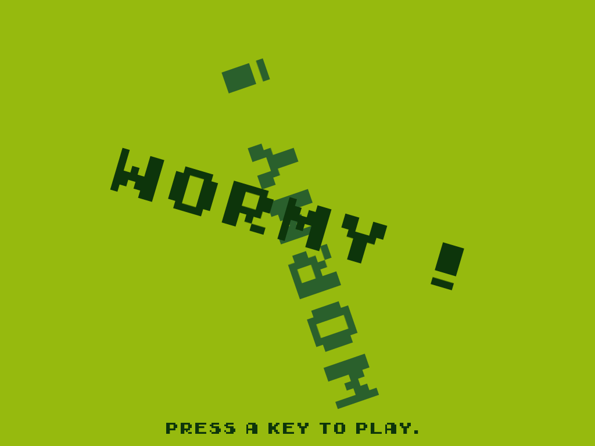

# LÖVE Wormy

Simple a Nibbles clone written in Love2D game framework. The example is largely based on this example(https://inventwithpython.com/wormy.py).

## Screenshots

## Addons
* [Love2D](https://love2d.org) - website of LÖVE.
* [Making Games with Python & Pygame](https://inventwithpython.com/pygame/) - great Pygame examples and a source of knowledge.
* [Font](https://www.dafont.com/early-gameboy.font) - dafont website
* [Music](https://opengameart.org/content/gameboy-song-1) - opengameart
* [PickUpSFX](https://opengameart.org/content/level-up-power-up-coin-get-13-sounds) and [HitSFX](https://www.leshylabs.com/apps/sfMaker/) - opengameart / leshylabs
* [Gameplay](https://youtu.be/_T9liljcEZ0) - youtube
